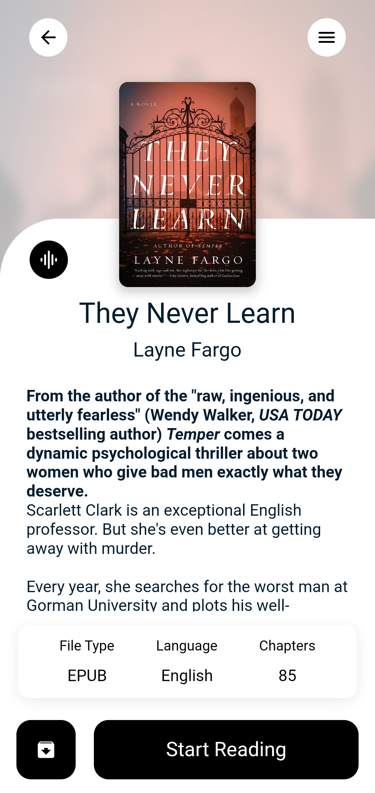
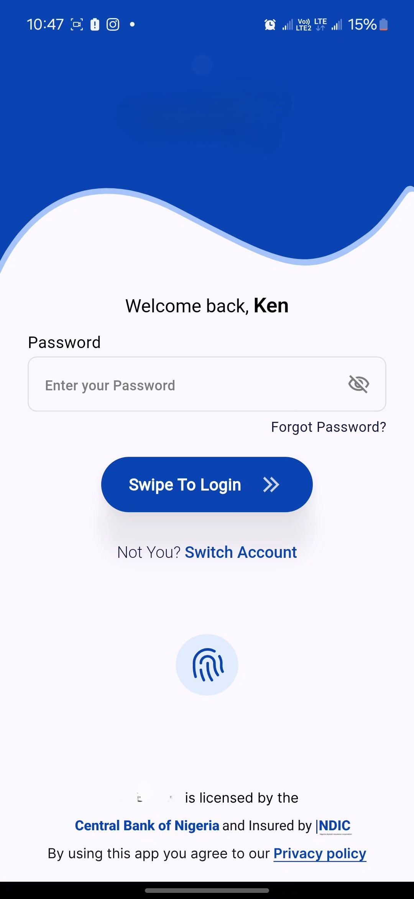
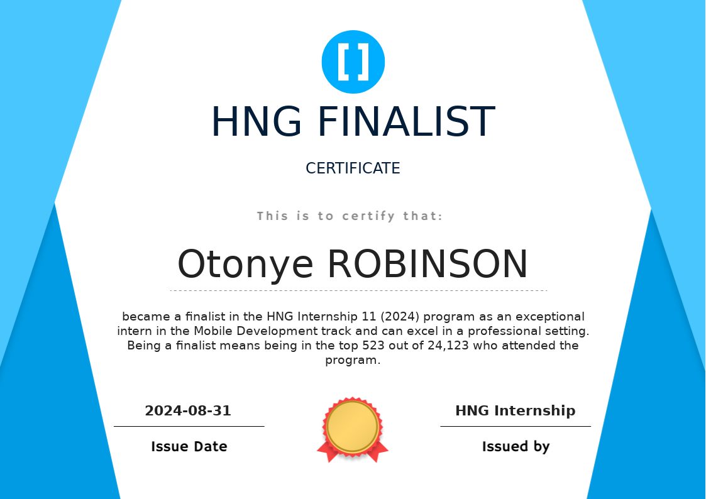

<h1 style="text-align: left;">Hi, I'm Otonye</h1>

<h3 style="text-align: center; color: white;">I'm very passionate about turning ideas and business solutions into code.   I'm a Junior Flutter Developer & IT Engineer   I've come to really love working with Flutter, and as a result   that's what most of my personal projects are currentlly based on  I hope to keep expanding my skill base as I grow and learn.</h3>

<h2 style=" color: white;"> 🔹 What I Work On </h2>

- 📱 **Mobile Development** – Flutter (Riverpod, Provider, Bloc), ARCore, Firebase  
- 🌍 **API Integration** – RESTful APIs, Dio, GraphQL  
- 🛠 **State Management** – Riverpod, Provider, Redux  
- 🔐 **Authentication** – Firebase Auth, Biometric Login  
- 🎨 **UI/UX** – Material Design, animations, custom widgets

## 📌 Featured Projects  
🔹 **[Timbu Store App](https://github.com/your-repo-link)** – A Flutter-based eCommerce app using Riverpod and API integration.  
🔹 **[AR Treasure Hunt Game](https://github.com/your-repo-link)** – Augmented reality game using Flutter & ARCore.  
🔹 **[Authentication Flow](https://github.com/your-repo-link)** – Secure login system with biometric authentication.  

<h2 style=" color: white;">✨ Projects Showcase ✨</h2>

Here are some of the projects I've worked on:  

## 🛒 Malltiverse (E-commerce App)  

    
    
    
    

  

---

## 🔐 Veritag (App that leverages NFC technology to ensure product authenticity and product tracking)  

    
    
    

  

---

## 🗺️ Ada. (First Aid and Emmergency AI Assistant)  

    
    
    

    
    

  

---

## 🎬 LA FIN (Simple Store App)

    
    

  

---

## 📚 Litaffi (Bookstore App)  

    
    
    

  

---

## 📻 Radio Streaming App for GCR

    
    

  

---

## 🍔 HebronEats (Food Delivery App for Covenant University)  

    

  

---

## 🎭 Login UI of a Banking App

    

  

  <h2>⚡ Fact About Me </h2>
  
<strong>I am an HNG Finalist</strong>

  

<h2 style=" color: white;"> Technologies I work with </h2>

<h3>Languages</h3>

  
 
  
  
  

<h3>Frameworks/Libraries</h3>

 
 
 
 

<h3>Tools</h3>

 
 
 

<h2 style="color:"white">💬  Sometimes I like to write on <a href="https://dawndev.hashnode.dev/"> Hashnode...</a></h2>

<h3> I'm open to collaborations and new friends </h2>

<h3><em>Fun fact: I love cats and cake<em></h3>

<!--
**OtonyeR/OtonyeR** is a ✨ _special_ ✨ repository because its `README.md` (this file) appears on your GitHub profile.

Here are some ideas to get you started:

- 🔭 I’m currently working on ...
- 🌱 I’m currently learning ...
- 👯 I’m looking to collaborate on ...
- 🤔 I’m looking for help with ...
- 💬 Ask me about ...
- 📫 How to reach me: ...
- 😄 Pronouns: ...
- ⚡ Fun fact: ...
-->
